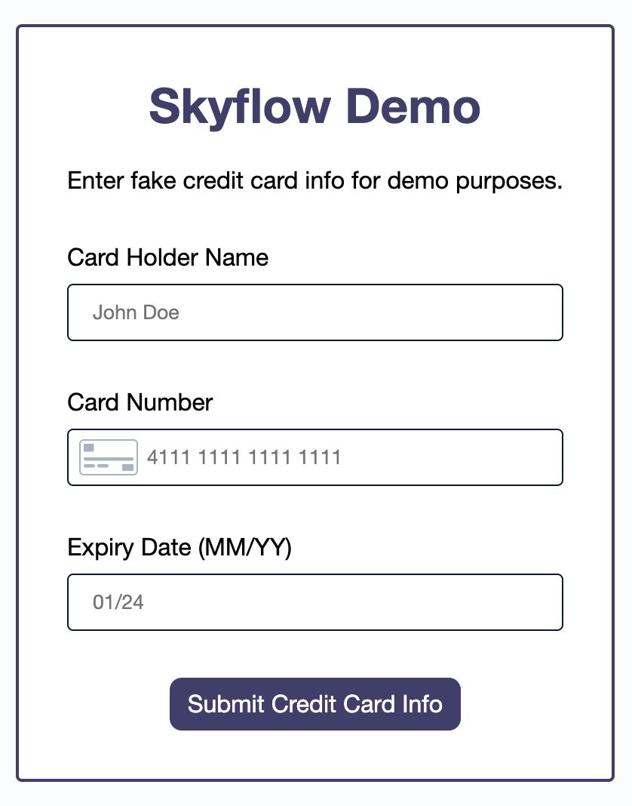

# Skyflow Demo

Skyflow demo for data privacy vaults

## Running the App Locally

There is one environment variable the app needs. Create an `.env` file with a variable for `SKYFLOW_BEARER_TOKEN`. This value can be obtained after creating a free account with [Skyflow](https://www.skyflow.com/). Once you have an account created and your `.env` file populated with your bearer token, follow these instructions to start the app.

1. `yarn install`
2. `yarn start`
3. Navigate to http://localhost:3000 in your browser

## NPM Scripts

- `format`: Formats the code using Prettier
- `format-watch`: Formats the code using Prettier in watch mode
- `start`: Starts the app locally with a Node Express.js server running on port 3000

## Resources

### Skyflow

- Skyflow Website: https://www.skyflow.com/
- Skyflow Docs: https://docs.skyflow.com/
- Product Overview: https://docs.skyflow.com/developer-portal/getting-started/product-overview/
- Core API Quickstart: https://docs.skyflow.com/developer-portal/getting-started/core-api-quickstart/
- Skyflow SDKs: https://docs.skyflow.com/developer-portal/sdks/

### Other Tools

- Express.js: https://expressjs.com/
- Prettier: https://prettier.io/
- on-change: https://www.npmjs.com/package/on-change

## Demo Screenshots

### Starting Point

### Filled Out Form

### Submitted Form

### Response Data

### Data in Skyflow Vault (Redacted)

### Data in Skyflow Vault (Plain Text)
